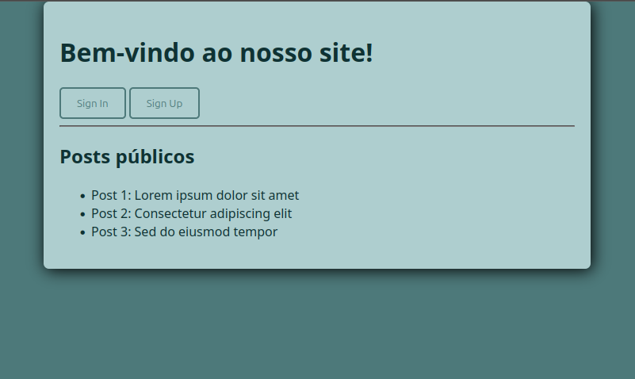

# Nome do Projeto

## 🛠️ Tecnologias Utilizadas

### Front-end


### Ferramentas


---

## 🚀 Como rodar o projeto

### 📥 Clonar o repositório
```bash
git clone https://github.com/eriick-monteiro/Sistema-de-Login.git
cd Sistema-de-Login
```

### ✅ Pré-requisitos

### .env
Certifique-se de ter o arquivo `.env` com o seguinte conteúdo:

```js
SITE_NAME = "Site Teste"
SECRET_KEY = 'generated_in_generate_hash_key.py'
```


### Criação do Ambiente Virtual (venv)
```bash
$ python3 -m venv venv
```


### Ativando o Ambiente Virtual
```bash
# Linux / macOS
$ source venv/bin/activate

# Windows
$ .\venv\Scripts\activate
```

### 📦 Instalar dependências

```bash
pip install -r requirements.txt
```

### Criar Tabelas
```bash
$ python3 init_db.py
```


### ▶️ Rodar em ambiente de desenvolvimento

```bash
python3 app.py
```

Por padrão o Flask vai rodar em:
👉 http://localhost:5000


### 📸 Preview

